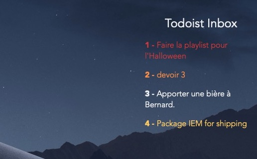
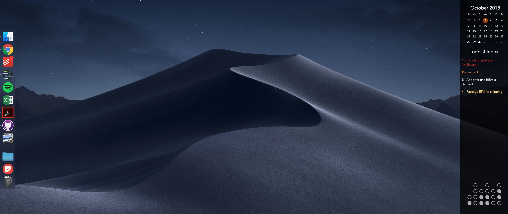

# Inbox for [Todoist](https://en.todoist.com/tour) #
## An Übersicht widget for your Todoist Inbox ##
---
## About ##
Inbox for [Todoist](https://en.todoist.com/tour) is a simple Übersicht widget designed to present your todoist inbox on your Desktop. It is in no way affiliated with the Brand Todoist or Doist in any way nor is it affiliated with [Übersicht](http://tracesof.net/uebersicht/) or [Felix Hageloh](https://github.com/felixhageloh)

Below is a preview of what Inbox for Todoist can look like:

In some context with other widgets, your interface could look like this:

## Installation ##
Clone this repository to your Übersicht folder:
`~/Library/Application Support/Übersicht/widgets/`

### Setting up your own Todoist Token ###
The `inbox_for_todoist` folder contains a file named `todoist_API.txt`. In that file, replace
`___YOUR TODOIST TOKEN HERE:___` (keep the ' ' for it to work) with your very own todoist API token.

You todoist token can be found on [Todoist](https://todoist.com) inside of `settings` and then `Integrations`. It will be labelled as `API Token`.

Rest assured that if you submit a pull request, your token will not be shared as `todoist_API.txt` has been set to be ignored by github inside the `.gitignore` file `line: 108`. Also none of your tasks stored inside your offline cache will be shared as `todoist.cache` has been set to be ignored by github inside the `.gitignore` file `line: 105`.

## Preferences ##
### Refresh Rate ###
By default, Inbox for Todoist refreshes every second. To reduce CPU & Memory Usage, you may go to `line: 5` of `index.coffee` and adjust this:

| Removing the first  | `#` | will make the widget refresh every | `minute`.     |
|:--------------------|:----| :--------------------------------- | ------------- |
| __Removing the second__ | `#` | __will make the widget refresh every__ | `5 minutes`.  |
| __Removing the third__  | `#` | __will make the widget refresh every__ | `10 minutes`. |
| __Removing the fourth__ | `#` | __will make the widget refresh every__ | `20 minutes`. |
| __Removing the fifth__  | `#` | __will make the widget refresh every__ | `hour`.       |
| __Removing the sixth__  | `#` | __will make the widget refresh every__ | `12 hours`.   |

## Priority Color Coding ##
You can change the colors of tasks inside of the `.coffee` file.
By default, tasks are colored the same way they are in the todoist mac app in dark.
The following line to edit are:

 To edit the color of tasks labelled | `priority1` | edit the | `rgba(r, g, b, a)` | on line  | `21`
--|---|---|---|---|--
 __To edit the color of tasks labelled__ | `priority2` | __edit the__ | `rgba(r, g, b, a)` | __on line__ | `23`
 __To edit the color of tasks labelled__ | `priority3` | __edit the__ | `rgba(r, g, b, a)` | __on line__ | `25`
 __To edit the color of tasks labelled__ | `priority4` | __edit the__ | `rgba(r, g, b, a)` | __on line__ | `27`

The default color for the widget is `rgba(#F2F2F2, 1.0)`.

## Recent Updates ##
-   `2018-11-04` Widget now keeps an offline cache of your tasks
    -   No more Error messages when you computer's offline (due to cache)
-   `2018-11-04` API keys are stored on a .txt file outside the script. (`todoist_API.txt`)
-   `2018-10-03` Priority color coding Support

## Possible Eventual Improvements ##
(checked items are under developpement)
-   [ ] Task Sorting
    - [ ] Tasks sorted by due date first
    - [ ] Task sorted by priority second
-   [ ] Todoist Markdown Support
-   [ ] Indent embedded subtasks
